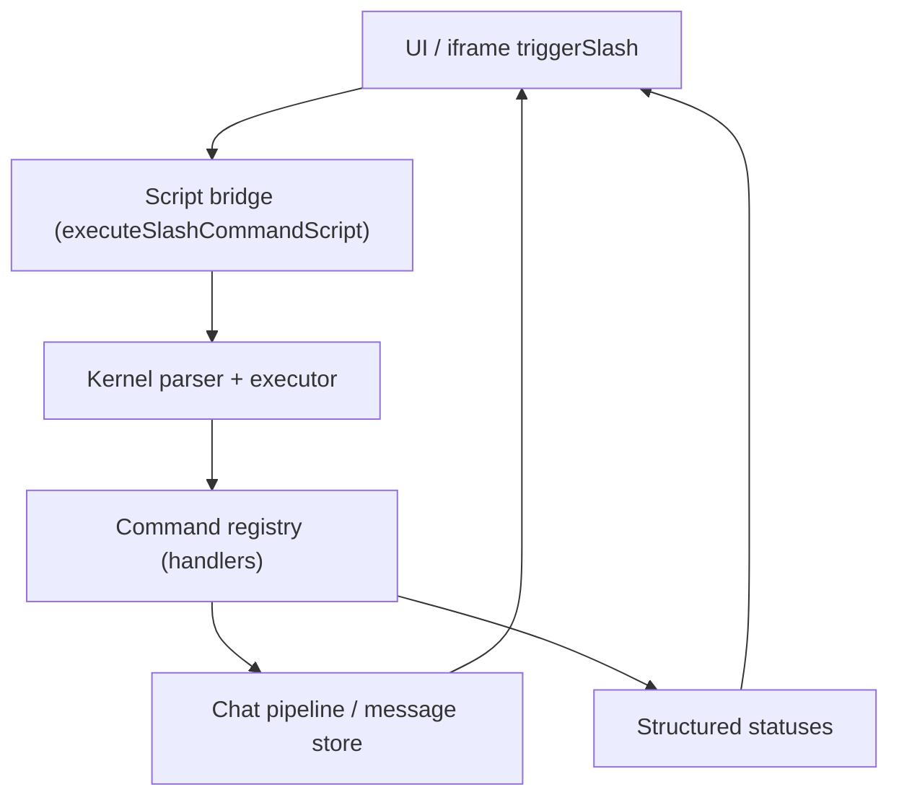

# Design Document

## Overview

Continue the slash command migration by (1) ensuring UI/iframe triggers execute scripts via the new kernel with full state propagation, (2) rendering role-specific outputs (system/narrator/impersonate) and swipe flows correctly, and (3) adding P2 math/string/array commands with strict type semantics and tests. The design keeps command core decoupled from UI, uses small adapters for dispatch, and reinforces regression guardrails.

## Architecture

Data/control flow centers on the existing kernel plus a UI/iframe bridge:

Key boundaries:
- Bridge only normalizes inputs/outputs and surfaces statuses; no business logic.
- Registry provides descriptors/handlers for P2 commands and roleful message actions.
- Pipeline handles persistence and rendering; bridge supplies role metadata so UI can style and swipe appropriately.

## Components and Interfaces

- **UI/Iframe Bridge**
  - Entry: `triggerSlash` (existing) delegates to `executeSlashCommandScript`.
  - Responsibilities: pass script text/context, capture generator statuses (`return`/`break`/`abort`/errors), dispatch handler payloads to chat pipeline callbacks (`onSend`, `onTrigger`, `onSendAs`, `onSendSystem`, `onImpersonate`, `onContinue`, `onSwipe`).
  - Outputs structured result `{ status, messages?, variables?, error? }` to UI.

- **Command Registry**
  - Descriptors: name/aliases, args schema, handler signature `(ctx, args, pipe?) => result|signal`.
  - Existing P0/P1 retained; add P2 commands `/add`, `/sub`, `/len`, `/trim`, `/push` (others can extend pattern).
  - Type semantics: numeric-only for add/sub; len for string/array; trim for string; push for array (return updated array or error).
  - Errors must be typed (e.g., `{ code: "type_error", expected, received }`) for UI display and tests.

- **Message Pipeline Integration**
  - Bridge calls existing chat store methods to append with `role` metadata (system/narrator/impersonate).
  - Swipe: fallback uses existing generation/swipe path when specialized callback missing; expose selection/restore hooks.
  - Continue: ensures no duplicate token streams; pipeline de-dup guards.

- **State Persistence**
  - Variable mutations from scripts bubble to session store; closures run with scope push/pop preserved.
  - Pipeline receives variable diff for potential telemetry/logging (optional, non-blocking).

## Data Models

- **SlashExecutionResult**
  - `status`: `ok | return | break | abort | error`
  - `messages?`: emitted message envelopes `{ role, content, metadata }`
  - `variables?`: updated bindings snapshot/diff
  - `error?`: `{ code, message, details }`

- **CommandDescriptor (existing shape)**
  - `name`, `aliases`, `args` schema, `handler`
  - `capabilities`: marks role outputs or state mutation to aid UI expectations

- **Message Envelope**
  - `role`: `user|assistant|system|narrator|impersonate`
  - `content`: string/blocks
  - `swipe`: optional candidates/reference for restore
  - `meta`: source (`slash-command`), timestamps, script id

## Error Handling

- Parse errors: include position/range; surfaced to UI without emitting messages.
- Handler errors: typed codes (`type_error`, `arity_error`, `runtime_error`) with expected vs received detail; no partial emissions on failure.
- Control signals (`return|break|abort`): propagated as `status` without converting to errors; bridge prevents further message dispatch after terminal signals.
- Swipe/continue guard: prevent duplicate sends by tracking in-flight generation ids.

## Testing Strategy

- Unit/property tests for P2 commands: happy paths and type/arity failures; ensure no regression to P0/P1 tests.
- Integration tests for bridge→kernel→pipeline: mock pipeline callbacks to assert role metadata, swipe fallback, and variable persistence.
- Snapshot tests for UI rendering of roleful messages and swipe restore flow.
- Error-path tests: parse failures, handler errors, control signals halting emissions.
- CI gate: targeted `pnpm vitest` suites covering kernel/property/P1 + new P2/bridge/UI snapshots.
